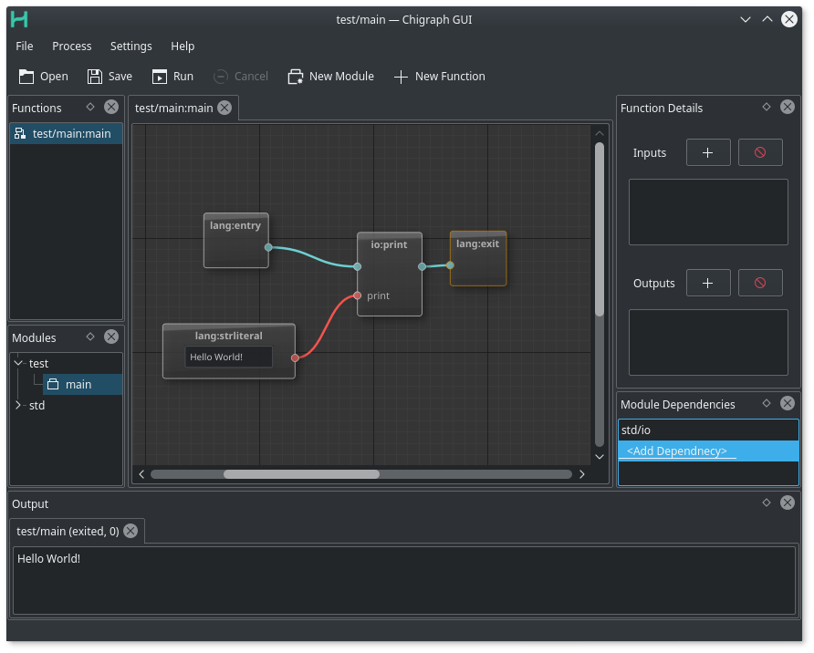

***DISCLAIMER: CHIGRAPH IS IN PRE-PRE-PRE-PRE ALPHA STATUS AND MAY NEVER REACH A STABLE RELEASE. IT'S A TOY PROJECT AS A PROOF OF CONCEPT.***


[](https://coveralls.io/github/chigraph/chigraph)    [](https://gitter.im/chigraph/)


__Build Status__

Platform | Status
----- |  ----
| Linux/macOS    | [](https://travis-ci.org/chigraph/chigraph) |
| Windows        |  [](https://ci.appveyor.com/project/GuapoTaco/chigraph-miekk) |
| Buildbot (in development)      | [Buildbot](https://ci.chigraph.io/) |

# What is chigraph?
Chigraph,  pronunced chai-graph, is a new systems programming language. It's fast. It's scalable. And, more importantly, it's easy to learn. How does it achieve such goals? By scrapping the age-old standard of text (not entirely though). Here's a screenshot from [the Qt5 GUI](https://github.com/chigraph/chigraph-gui):



> **NOTE**
> This is the repository for the chigraph language. If you are looking for the interface that goes along with it, see https://github.com/chigraph/chigraph-gui

# Components
Chigraph is made up of three components:

## chi
chi is the command line interface to chigraph. It lets you compile and run chigraph modules:
```bash
$ pwd
~/chigrpah/src/
$ chi get github.com/russelltg/hellochigraph/hello/main # download it
$ cd github.com/russelltg/hellochigraph/hello/main
$ chi run main.chimod # run it
Hello World!
```

## libchigraph
libchigraph is the chigraph library that provides all functions for chigraph clients, like code generation, graph representation, etc. Want to compile a chigraph module using libchigraph? ([documentation](https://chigraph.github.io/chigraph/))

```C++
#include <chi/Context.hpp>

int main() {
    chi::Contxt myContext{"/path/to/workspace"};

    // download and load the module
    myContxt.loadModule("github.com/russelltg/hellochigraph/hello/main", chi::LoadOptions::FetchDependencies);

    // compile it
    llvm::Module* mod;
    myContxt.compileModule("github.com/russelltg/hellochigraph", &mod);
}
```

And tada, you have yourself a [`llvm::Module`](http://llvm.org/docs/doxygen/html/classllvm_1_1Module.html) to do whatever you wish to. It'll have all it's dependencies linked in and a main function waiting to run.

## libchigraphdebugger
libchigraphdebugger is a library that makes it easy to implement chigraph debuggers. See [the `Debugger` documentation](https://chigraph.github.io/chigraph/classchi_1_1Debugger.html) for more details.

# Licensing
It's free!
Chigraph is licensed under the [Apache License 2.0](https://www.apache.org/licenses/LICENSE-2.0) so anyone can use it for free, even in proprietary settings (solong you attribute me)

# API Documentation
API Documentation (generated by [doxygen](http://doxygen.org)) can be found [here](https://api.chigraph.io/).

# Installation
## Download installers/appimage
Installers and appimages are avaliable from the [releases page](https://github.com/chigraph/chigraph/releases) (coming soon) for those who don't want to build from sources.

## Building from source
See the [guide on building from source](doc/building.md)

# Get Involved
Getting involved is easy!
If you don't know where to get started, start looking at [filed github issues](https://github.com/chigraph/chigraph/issues) for inspiration. Then just file a PR!

If you have any questions, you're more than welcome to email me: [russellgreene8@gmail.com](mailto:russellgreene8@gmail.com)

# Authors

- Russell Greene (@russelltg) - Main contributor
- Aun-Ali Zaidi (@aunali1) - Helped with some platform stuff, packaging


# Technology used
- [LLVM/Clang](http://llvm.org) for compilation
- [libgit2](https://libgit2.github.com/) for downloading remote modules
- [Catch](https://github.com/philsquared/Catch/) for unit tests
- [boost](https://boost.org) for [filesystem](http://www.boost.org/doc/libs/1_63_0/libs/filesystem/doc/index.htm), [parsing program arguments](http://www.boost.org/doc/libs/1_63_0/doc/html/program_options.html), [uuid](http://www.boost.org/doc/libs/1_63_0/libs/uuid/uuid.html), [bimap](http://www.boost.org/doc/libs/1_63_0/libs/bimap/doc/html/index.html), [range](http://www.boost.org/doc/libs/1_63_0/libs/range/doc/html/index.html), [string_view](http://www.boost.org/doc/libs/1_63_0/boost/utility/string_view.hpp), [dynamic_bitset](http://www.boost.org/doc/libs/1_63_0/libs/dynamic_bitset/dynamic_bitset.html)

> Written with [StackEdit](https://stackedit.io/).
