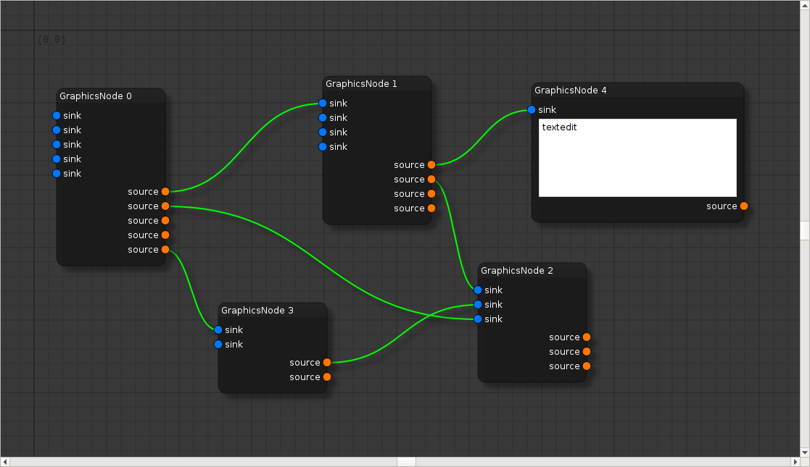

Qt5 Node Editor
===============

an early version of a node editor written in Qt and C++11. may still contain
lots of bugs, and some logical issues. upcomming changes will contain (but will
not be limited to):

* Qt naming scheme of methods, variables, etc.
* develop data model. At the moment it's just VC instead of MVC
* moving some of the UI logic to the data model (node.hpp and node.cpp)
* restructuring the directory
* providing cmake file to generate a library

Hence, *be warned* that the API is not settled yet and is likely to change in
future releases.

Example Screenshot:

How to build
------------

You need cmake (>= 2.8.8), and a recent C++ compiler. For an out-of-directory
build (recommended), create a build folder, and call cmake/make in there:

.. code::

        $ mkdir build
        $ cd build
        $ cmake ..
        $ make

The library will end up in lib/ of your build directory, all compiled examples
in bin/.
