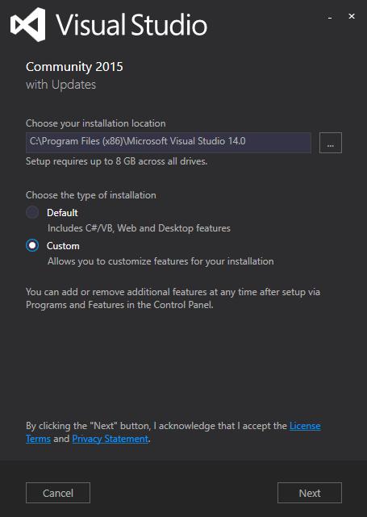
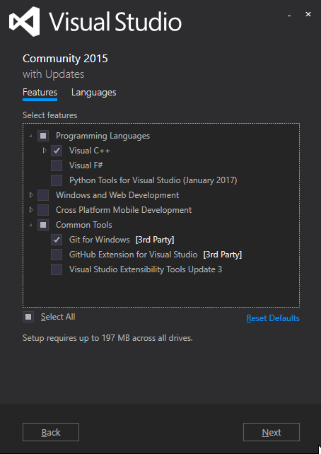
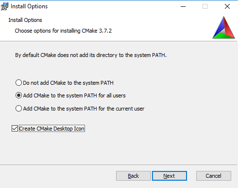
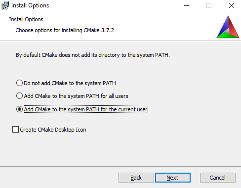

# Building chigraph from source
Currently, the only way to get chigraph is to build from source.

It currently works on linux (x86_64) and Windows (x64). Mac support is being worked on.

## Linux

### Installing dependencies
The external dependencies of chigraph are:
- A compiler supporting C++14 (clang 3.7+, gcc 4.8+)
- git (to clone chigraph)
- CMake 3.0+
- LLVM 3.5+
- *Boost
- *libgit2

*: These dependencies are optional and will be compiled with chigraph by default. Pass to cmake `-DCG_USE_SYSTEM_BOOST=ON` or `-DCG_USE_SYSTEM_LIBGIT2=ON` to use the system version.

#### Ubuntu/Mint (Xenial or newer):
```bash
sudo apt-get update
sudo apt-get install git llvm-dev clang cmake
```

If your version doesn't supply new enough llvm versions, use [LLVM's ppa](https://apt.llvm.org)
#### Arch Linux
I personally use Arch for most of chigraph's development, so this is pretty guaranteed to work:
```bash
sudo pacman -Sy
sudo pacman -S llvm cmake git
```

#### OpenSUSE
```bash
sudo zypper install llvm-devel clang git cmake
```

### Compiling Chigraph
In order to compile chigraph, first generate the project files with cmake:
```bash
git clone https://github.com/chigraph/chigraph
mkdir chigraph/build
cd chigraph/build
cmake .. -DCMAKE_BUILD_TYPE=<Release|Debug> \
	-G<Your generator> \
	-DCMAKE_PREFIX_PATH=<Qt install prefix if nonstandard> \
	-DLLVM_CONFIG=<path to llvm-config of the llvm version you want to use> \
	[ -DCG_USE_SYSTEM_BOOST=ON ] \
	[ -DCG_USE_SYSTEM_LIBGIT2=ON ]
```
See [the CMakeLists.txt](https://github.com/chigraph/chigraph/blob/master/CMakeLists.txt) for a full list of options.

Some example CMake calls:

Debug with all default locations (works on arch, ubuntu yakkety or xenial):
```bash
cmake .. -DCMAKE_BUILD_TYPE=Debug
```
Debug using the LLVM PPAs:
```bash
cmake .. -DCMAKE_BUILD_TYPE=Debug \
	-DLLVM_CONFIG=/usr/lib/llvm-3.9/bin/llvm-config \
```


Then, you can compile it!
```
cmake --build .
```

To test that everything is sane and working, it's a good idea to quickly run the tests (it only takes a few seconds)
```bash
cmake --build . --target test
```

## macOS
I've only personally tested chigraph on Sierra (10.12.3) but I'd assume it works fine on other versions.

### Installing dependencies
 
First, [install brew](http://brew.sh)

Then, it's as easy as:
```bash
brew install cmake llvm wget
```

Clone chigraph...
```bash
git clone https://github.com/chigraph/chigraph
cd chigraph
```

### Compiling chigraph
Finally compile chigraph:
```
mkdir build && cd build
cmake .. -DCMAKE_PREFIX_PATH='/usr/local/opt/qt5/;/usr/local/opt/gettext' \
	-DCMAKE_BUILD_TYPE=Debug \
	-DLLVM_CONFIG=/usr/local/opt/llvm/bin/llvm-config
cmake --build .
```

## Windows

## Installing dependencies

First, Install [Visual Studio 2015](https://www.visualstudio.com/downloads/). 2015 is the only version that has been tested, 2013 won't work (not new enough compiler) and I've been having troubles compiling LLVM with 2017.



and pick Visual C++ and git:



Install [CMake](https://cmake.org/download/). I suggest you use an installer, it's harder to screw up. Make sure to get a stable release because those are better tested (they usually put the release candidates on top). Make sure to add cmake to path for either all users or just the current one:



OR



Then, download LLVM from the [chigraph releases page](https://github.com/chigraph/chigraph/releases/tag/dependencies) and extract it. Choose either debug or release, and take note for later.

Finally, open up the CMake gui and point it to the source directory and a separate build directory. Create an entry for `LLVM_CONFIG` that points to the `llvm-config.exe` in the LLVM you downloaded.

Configure, generate, and open the project file!


Any errors? [File an issue!](https://github.com/chigraph/chigraph/issues/new)
