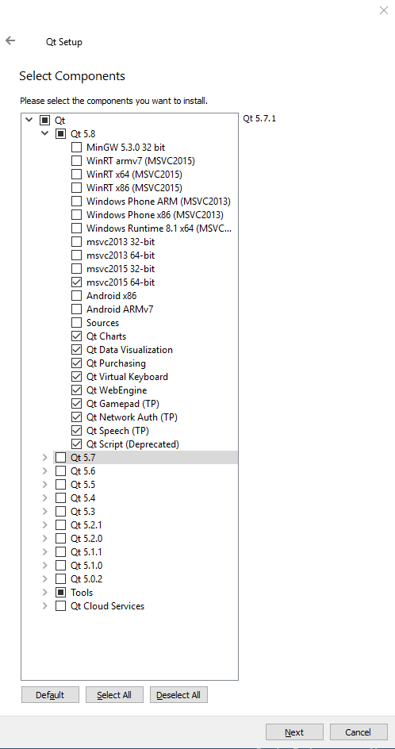
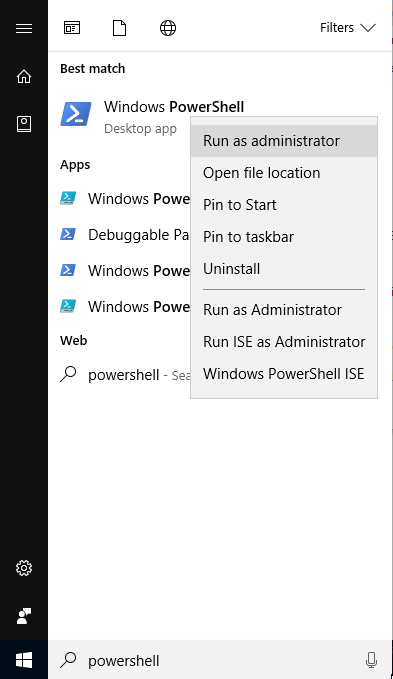

# Building chigraph from source
Currently, the only way to get chigraph is to build from source. 

As of now, only linux x86_64 and macOS Sierra have been tested, but work is being done on getting it to work on Windows. Here we go! 

## Linux

### Installing dependencies
The external dependencies of chigraph are:
- A compiler supporting C++14 (clang 3.7+, gcc 4.8+)
- git (to clone chigraph)
- CMake 3.0+
- LLVM 3.7+ (the tests only pass with 3.9, but the interface works fine with 3.7 and 3.8)
- Qt 5.6+
- KDE Frameworks 5

#### Ubuntu/Mint (Xenial or newer):
```bash
sudo apt-get update
sudo apt-get install git llvm llvm-dev clang qtbase5-dev qtdeclarative5-dev qtscript5-dev libqt5x11extras5-dev libqt5svg5-dev cmake extra-cmake-modules gettext libkf5xmlgui-dev

```
If your version doesn't supply new enough llvm versions, use [LLVM's ppa](https://apt.llvm.org)
#### Arch Linux
I personally use Arch for most of chigraph's development, so this is pretty guaranteed to work:
```bash
sudo pacman -Sy
sudo pacman -S llvm qt5 kf5 cmake git extra-cmake-modules
```

#### OpenSUSE
```bash
sudo zypper install llvm-devel clang libqt5-qtbase-devel libqt5-qtdeclarative-devel libqt5-qtscript-devel libqt5-qtsvg-devel libqt5-qttools-devel libqt5-qtx11extras-devel kxmlgui-develk textwidgets-devel extra-cmake-modules git gettext-tools
```

#### Other distributions
If you're not sure how to install qt5 and llvm on your system, then download the prebuilt binaries for each.

You can get qt binaries [here](https://download.qt.io/archive/qt/5.8/5.8.0/) and LLVM binaries [here](http://releases.llvm.org/download.html#3.9.1) (use the "Clang for x86_64 Ubuntu 16.04" download)

If you can't get ahold of a binary package of KDE Frameworks 5, run `./scripts/build_frameworks.sh` to build on in tree (automatically configured to work)


### Compiling Chigraph
In order to compile chigraph, first generate the project files with cmake:
```bash
git clone https://github.com/chigraph/chigraph --recursive 
mkdir chigraph/build
cd chigraph/build
cmake .. -DCMAKE_BUILD_TYPE=<Release|Debug> \
	-G<Your Generator, Use 'Ninja' or 'Unix Makefiles'> \
	-DCMAKE_PREFIX_PATH=<Qt install prefix> \
	-DLLVM_CONFIG=<path to llvm-config of the llvm-version you want to use> \
	-DCLANG_EXE=<path to clang> \
	-DLLI_EXE=<path to lli>
```

You can leave out the last 4 parameters if they are all installed in a standard location.

Some example CMake calls:

Debug with all default locations (works on arch, ubuntu yakkety or xenial):
```bash
cmake .. -DCMAKE_BUILD_TYPE=Debug
```
Debug using the LLVM PPAs:
```bash
cmake .. -DCMAKE_BUILD_TYPE=Debug \
	-DLLVM_CONFIG=/usr/lib/llvm-3.9/bin/llvm-config \
	-DCLANG_EXE=/usr/lib/llvm-3.9/bin/clang \
	-DLLI_EXE=/usr/lib/llvm-3.9/bin/lli
```


Then, you can compile it!
```
cmake --build .
```

To test that everything is sane and working, it's a good idea to quickly run the tests (it only takes a few seconds)
```bash
cmake --build . --target test
```

## macOS
I've only personally tested chigraph on Sierra (10.12.3) but I'd assume it works fine on other versions.

### Installing dependencies
 
First, [install brew](http://brew.sh)

Then, it's as easy as:
```bash
brew install cmake llvm wget qt5 bison gettext # [ninja]
```
It's optional to install `ninja`, which is a slightly faster build system.

Clone chigraph...
```bash
git clone https://github.com/chigraph/chigraph --recrusive
cd chigraph
```

Then, compile KDE frameworks 5:
```bash
./scripts/build_frameworks.sh \
	-DCMAKE_BUILD_TYPE=Debug \ 
	-DCMAKE_PREFIX_PATH='/usr/local/opt/qt5;/usr/local/opt/gettext' \
	-DBISON_EXECUTABLE=/usr/local/opt/bison/bin/bison # -GNinja if you installed ninja
```

### Compiling chigraph
Finally compile chigraph:
```
mkdir build && cd build
cmake .. -DCMAKE_PREFIX_PATH='/usr/local/opt/qt5/;/usr/local/opt/gettext' \
	-DCMAKE_BUILD_TYPE=Debug \
	-DLLVM_CONFIG=/usr/local/opt/llvm/bin/llvm-config \
	-DLLI_EXE=/usr/local/opt/llvm/bin/lli # -GNinja if you installed it
cmake --build .
```
Then run it!
```bash
open ./gui/chiggui.app
```

## Windows

## Installing dependencies

First, Install [Visual Studio 2015](https://www.visualstudio.com/downloads/). 2015 is the only version that has been tested, 2017 RC might work but you'd have to compile qt. Make sure to choose custom install:


and pick Visual C++ and git:


Install [Qt open source 5.6 or newer](https://www.qt.io/download-open-source). Make sure you install msvc2015_64 binaries:



Install [CMake](https://cmake.org/download/). I suggest you use an installer, it's harder to screw up. Make sure to get a stable release because those are better tested (they usually put the release candidates on top). Make sure to add cmake to path for either all users or just the current one:


OR


Then, download LLVM from the [chigraph releases page](https://github.com/chigraph/chigraph/releases/tag/dependencies) and extract it. Choose either debug or release, and take note for later. 

Next, [install python 3](https://www.python.org/downloads/release/python-360/) into `C:\Python3`. It'll work if you don't install it there, just pass `-DPYTHON_EXECUTABLE=C:\path\to\python` to the `./build_directories.ps1` script below (at the end).

Finally, build KDE Frameworks 5:
Allow execution of remote scripts by opening powershell as an admin:


 and entering:
```powershell
Set-ExecutionPolicy RemoteSigned
```

Then press `A` to accept all.


Any errors? [File an issue!](https://github.com/chigraph/chigraph/issues/new)
